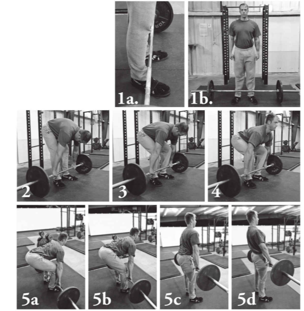
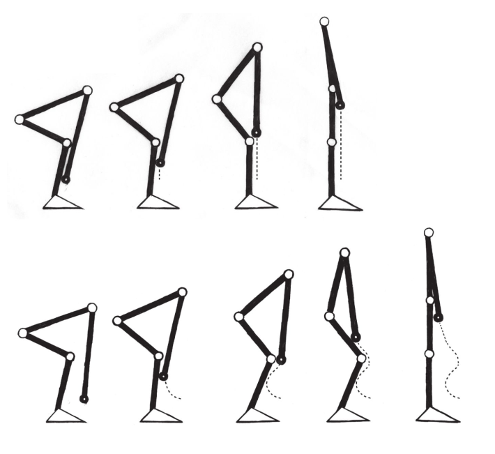
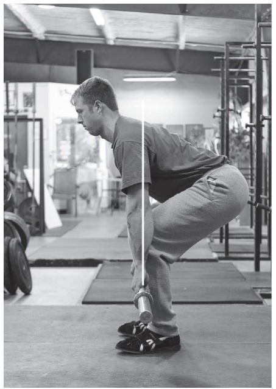
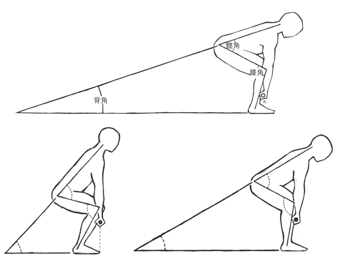

# 硬拉

## 学习硬拉
硬拉的站距相比较深蹲要窄，双脚发力蹬地，背部锁定。

- 杆位于脚掌中间位置
- 双手距离约47cm，双手应该刚好位于双腿两侧。
- 直腿，弯腰，不要移动杠铃
- 目光落在面前约4m
- 手臂不垂直于地面，但是必须是笔直的。手臂肌肉不能参与硬拉，仅作为连接。
- 完成肩部后收，胸部上挺，才算完成动作。

> 硬拉示例

### 完美硬拉五步法
1. 采用正确的站姿
2. 正确的握杆姿势
3. 下沉胫骨并使之向前接触杠铃，膝关节略微外展，髋部不要下沉
4. 挺起胸部，你的中心处于脚中心点上方
5. 沿着双腿把杠铃向上拖拽

> 应该是垂直方向做功

### 起始动作

### 角度之间关系

